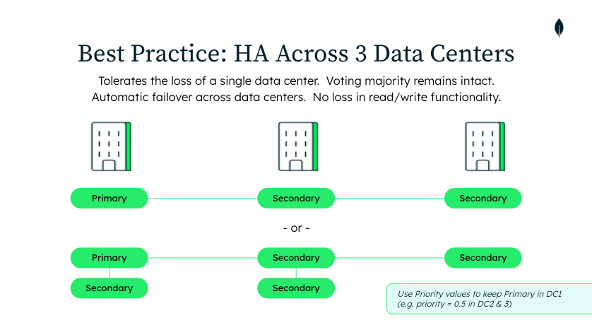
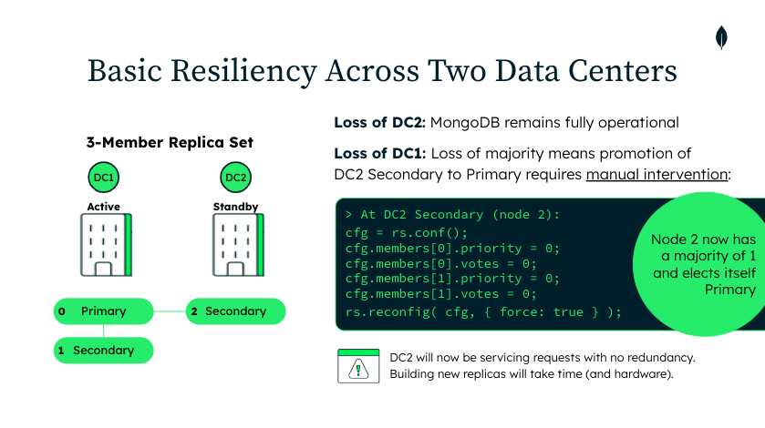
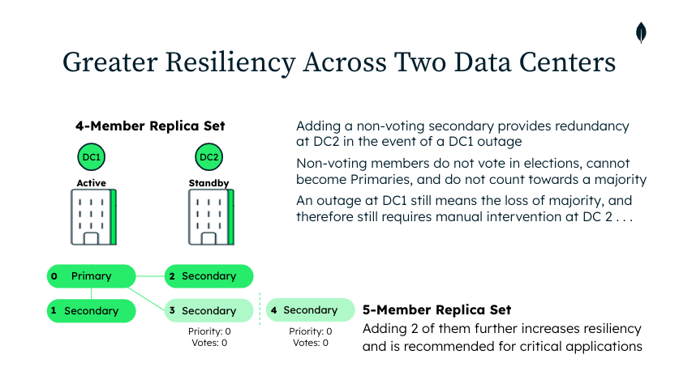
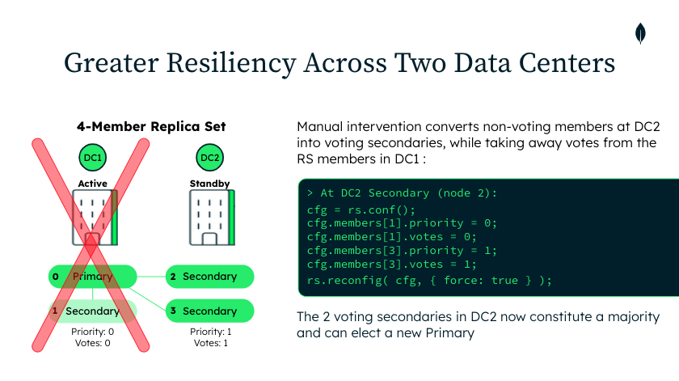

# Architecting for Multiple Data Centers

MongoDB Replica Sets provide automatic failover and high availability. 3-, 5-, and 7-node Replica Sets can tolerate one, two or three failures, respectively. Documentation can be found here: https://www.mongodb.com/docs/manual/core/replica-set-sync/.

Automatic failover occurs when a majority of voting members collectively identify the failure of the active Primary. By distributing these voting members across geographically distributed sites, MongoDB systems can remain fully operational, even in the event of a data center outage. To preserve the voting majority in such an event, Primary members should be distributed across three data centers. The following diagram shows two such configurations, for 3- and 5-node replica sets. 

If only two data centers are available, outside intervention is required to make the determination that a data center outage has occurred. Reconfiguration of the Replica Set will restore read/write operations in the surviving data center, as shown in the following diagram. In the scripts, this is **scenario 1**.

Additional replicas can be added to provide greater resiliency in the event of an outage. In the scripts, this is **Scenario 2**.

# Demonstration Scripts

The scripts provided in this folder can be used to simulate various architectures, failure scenarios, and recovery steps. Execute them in numbered order to launch a replica set locally, identify the primary and secondaries, launch test clients, similuate failures, and implement recovery procedures.

|Script|Purpose|
|---|---|
| 1-launchRS.sh | Launches a multi-node replica set on your local machine
| 2-checkRSstatus.sh | Connects to the local replica set and lists its primary and secondaries
| 3-runInserts.sh | A node.js client that performs continual inserts using a specified writeConcern
| 4-runQuery.sh | A node.js client that performs continual queries using a specified readPreference
| 5-killMDBprocess.sh | Kills the specified Replica Set member
| 6-intervention.(3/5)node.sh | Reconfigures the surviving data center to elect a new Primary and resume normal operations. Variants provided for both a 3- and 5-node deployment.
| 8-restoreRSmember.sh | Relaunches a previously killed Replica Set member
| restoreVotes.(3/5)node.sh | Restores the original vote configuration across the two Data Centers. Variants provided for both a 3- and 5-node deployment.
| buildScenario.sh | Builds demo scenario 2 by launching a 5-node Replica Set with the corresponding vote and priority settings. (Note that building Scenario 1 is trivial and can be accomplished using the launchRS.sh script)
| shutdownRS.sh | Shuts down the Replica Set and removes the data files

# Prerequisites

- *launchRS* requires MongoDB to be installed (but not running) on your local machine.
- mongosh (required by muliple scripts)
- The two test clients require node.js. 

